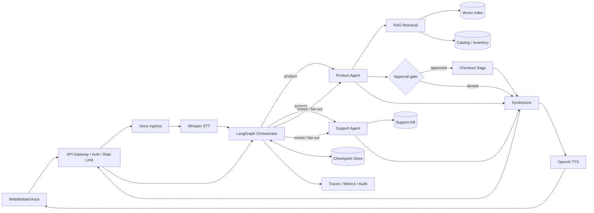

# AxiomCart — Voice-Enabled Multi-Agent Shopping Assistant

> Principal+/Distinguished-level reference architecture for stateful, voice-first agentic commerce. This repository is educational: product data and checkout are simulated; it never charges a payment method.

## Executive summary
AxiomCart turns speech or text into grounded shopping assistance using a **LangGraph StateGraph**. An Orchestrator classifies the request, dispatches specialized Product and Support capabilities, and a Synthesizer produces one answer. The Product Agent uses catalog RAG; Support is grounded in policy knowledge. `MemorySaver` checkpoints graph state by `thread_id`. Checkout-like intent crosses a human approval boundary. Whisper transcription and OpenAI TTS are provider adapters; `OFFLINE_MODE=true` makes development deterministic.

## Architecture


### Control plane vs data plane
The **data plane** serves conversations: STT, routing, retrieval, agent execution, synthesis and TTS. The **control plane** owns prompt/tool versions, model routing policy, evaluation datasets, safety policy, catalog index promotion, tenant configuration, rollout gates and cost budgets. Keeping them separate lets operators change policy without coupling it to request execution.

### State model
State is explicit and typed: identity/thread, normalized user message, intent, retrieved products/support evidence, candidate cart, approval status, final response and append-only execution events. Production replaces in-memory `MemorySaver` with a durable checkpointer (Postgres/Redis depending durability requirements), encrypted at rest and TTL/retention controlled. Never use raw conversation memory as authorization.

## Agent topology
1. **Orchestrator** performs bounded routing, not unrestricted reasoning.
2. **Product Agent** retrieves product candidates and inventory facts. It can prepare proposed cart mutations but cannot commit payment.
3. **Support Agent** answers returns/warranty/shipping from grounded policy documents and escalates when evidence is missing.
4. **Synthesizer** merges evidence, exposes uncertainty and never invents unavailable commerce facts.

For true mixed-intent parallel fan-out, evolve the graph to LangGraph `Send`/parallel branches with reducers on `products`, `support` and events. The small runnable graph keeps the dependency surface easy to understand while the target topology is shown above.

## RAG design
**Offline implementation:** lexical retrieval over `app/data/products.json`. **Production target:** normalize catalog → chunk semantic fields → embed → vector index (FAISS for local/high-throughput immutable snapshots or Chroma/managed vector DB for service operation) → metadata/ACL filtering → hybrid BM25+dense candidates → reciprocal-rank fusion → cross-encoder reranking → availability/price hydration from source-of-truth commerce APIs. Vector results are discovery hints; price and stock must be refreshed from authoritative services before display/checkout.

### Anti-hallucination contract
The model cannot manufacture SKU, price, inventory, order state, policy or discount. Answers cite structured tool evidence internally; unsupported support questions abstain/escalate. Retrieved text is **data, not instructions**: strip/segment content, constrain tools, validate schemas and prevent retrieved prompt injection from changing system policy.

## Voice pipeline
`audio -> MIME/size validation -> malware/content controls -> Whisper STT -> normalization -> graph -> response -> TTS -> streaming client`. Production should stream partial STT and TTS, support barge-in/cancellation, use voice-activity detection, propagate deadlines, redact sensitive transcript fields, and avoid persisting raw audio unless explicitly required.

Latency budget example: ingress 50 ms; streaming STT first partial 300–700 ms; route 50–200 ms; retrieval 100–300 ms; model synthesis 500–1500 ms; TTS first audio 250–700 ms. Optimize **time-to-first-useful-audio**, not only end-to-end completion.

## Human-in-the-loop and transaction safety
Shopping recommendations are reversible; purchases are not. The graph therefore treats checkout, payment, cancellation, refund, address changes and high-risk account operations as privileged commands. Production flow: create immutable proposal → show exact SKU/quantity/current price/tax/shipping → interrupt → collect explicit approval → mint short-lived authorization token → start idempotent checkout saga → refresh inventory/price → reserve → authorize payment → commit order → emit audit event. Compensation releases inventory/payment authorization after partial failure. Never interpret “yes” from stale conversation history as approval for a changed proposal.

## Reliability
Target SLO examples: 99.95% text API availability; 99.9% voice-session availability; p95 text first-token <2 s; p95 retrieval <350 ms; 99.99% no unauthorized commerce mutation. Use deadlines and cancellation across branches, bounded retries with jitter only for retryable errors, circuit breakers per provider, bulkheads for STT/LLM/TTS/vector dependencies, and graceful degradation (voice→text, semantic→lexical, personalized→generic, agent→human).

## Consistency and idempotency
Conversation state may be eventually consistent, but checkout requires stronger invariants. Every mutation carries `tenant_id`, `user_id`, `proposal_id`, `idempotency_key`, policy version and trace ID. Deduplicate at the transactional boundary. Inventory reservation and payment authorization use a saga/outbox rather than pretending distributed exactly-once delivery exists.

## Security and privacy
Use OIDC/OAuth2 at ingress, workload identity/mTLS internally, RBAC/ABAC for tools, tenant-scoped retrieval, encryption, secret manager/KMS, PII redaction, configurable transcript retention and immutable audit logs. Threat model includes indirect prompt injection in catalog/support content, tool argument injection, cross-tenant retrieval, replayed approvals, poisoned embeddings, malicious audio/files, SSRF in external tools and model-provider data leakage.

## Observability
One trace spans audio upload/stream → STT → graph nodes → retrieval/reranking → LLM → approval → TTS. Record node latency, token counts, provider/model/prompt/index versions, retrieval IDs, abstentions, tool failures, checkpoint size and cost. Do not log secrets, payment data or unrestricted transcripts.

## Evaluation and release gates
Maintain versioned golden sets for intent routing, product relevance, policy QA, mixed intents, multi-turn memory, adversarial prompt injection, multilingual/noisy speech and approval safety. Measure Recall@K/NDCG/MRR for retrieval; groundedness, citation/evidence precision, task completion and abstention quality for generation; WER/task-semantic accuracy for voice; and unauthorized-action rate for agent safety. New prompts/models/indexes ship via offline eval → shadow → canary → A/B → promotion, with rollback tied to versioned artifacts.

## Scale and capacity
At 1M conversations/day with 8 turns average, average request rate is ~93 turns/s, but design for 10–20× peaks. Stateless API/worker replicas autoscale on concurrency/queue age. Separate CPU retrieval workers from model-provider I/O and optional GPU reranking/STT. Cache embeddings, stable catalog queries and policy retrieval—not authorization decisions or volatile price/inventory. Apply per-tenant token, audio-minute and tool-call budgets.

## Multi-region and disaster recovery
Run stateless serving active-active where regulation permits. Keep tenant residency explicit. Replicate catalog/index artifacts by immutable version; rebuild vectors from canonical catalog when needed. Durable checkpoints and audit/outbox data require tested backup/restore. Define RPO/RTO by tier (e.g. RPO <5 min/RTO <30 min for conversation metadata; stricter for order ledger owned by commerce systems). Fail closed for privileged mutations when authorization/audit dependencies are unavailable.

## Repository
```text
app/agents/graph.py       LangGraph StateGraph + MemorySaver
app/agents/nodes.py       orchestrator/product/support/synthesizer nodes
app/rag/catalog.py        deterministic catalog RAG baseline
app/voice/pipeline.py     Whisper + OpenAI TTS adapters/offline mode
app/services/support.py   grounded support KB
app/main.py               FastAPI text + voice endpoints
tests/                    retrieval and graph tests
k8s/                      deployment starter
.github/workflows/         CI
```

## Run locally
```bash
python -m venv .venv
source .venv/bin/activate
pip install -r requirements.txt
cp .env.example .env
uvicorn app.main:app --reload --port 8080
```
Text request:
```bash
curl -X POST http://localhost:8080/v1/chat -H 'content-type: application/json' -d '{"thread_id":"demo-1","user_id":"u-1","message":"Recommend noise cancelling headphones and explain the return policy"}'
```
For real voice, set `OFFLINE_MODE=false` and `OPENAI_API_KEY`. Never commit keys.

## Production evolution roadmap
**Stage 1:** current deterministic catalog + MemorySaver. **Stage 2:** embeddings/hybrid retrieval, Postgres checkpointer, Redis cache, OpenTelemetry. **Stage 3:** parallel `Send` fan-out, streaming STT/TTS, durable workflow engine for commerce mutations. **Stage 4:** multi-region serving, policy control plane, automated eval/canary promotion, tenant budgets. **Stage 5:** personalization using consented features and privacy-preserving profiles—never allowing personalization to bypass product, safety, or authorization policy.

## Principal-level design decisions / ADRs
- **ADR-001 StateGraph over free-form autonomous loops:** explicit topology is observable, testable and bounded.
- **ADR-002 Retrieval vs source-of-truth:** vectors discover; commerce APIs establish price/stock/order facts.
- **ADR-003 HITL for irreversible actions:** language-model confidence is not transaction authorization.
- **ADR-004 Memory is context, not identity:** checkpoint state cannot grant permissions.
- **ADR-005 Provider abstraction:** STT/LLM/TTS failures degrade independently and providers can change without rewriting business policy.
- **ADR-006 Evaluation is deployment infrastructure:** prompt/model/index changes are versioned releases, not ad-hoc configuration edits.

## Discussion prompts
Explanation of why a graph is preferable to a single mega-agent; how reducers avoid races in parallel branches; how you resume an interrupted graph safely; how approval binds to a specific cart snapshot; why RAG cannot be authoritative for price; how you stop catalog prompt injection; how checkpoint retention interacts with privacy; how voice streaming changes backpressure/cancellation; how you measure retrieval separately from generation; and how you migrate embedding models without downtime.

